<!-- Adding Banner -->

<h3 align="center">
  • Indie Full-Stack Web Developer
  • Tech Enthusiast 
  • Builder
</h3>

  Hi , I'm Danny,  

<!--
**Danyxtu/Danyxtu** is a ✨ _special_ ✨ repository because its `README.md` (this file) appears on your GitHub profile.

Here are some ideas to get you started:
- 🔭 I’m currently working on ...
- 🌱 I’m currently learning ...
- 👯 I’m looking to collaborate on ...
- 🤔 I’m looking for help with ...
- 💬 Ask me about ...
- 📫 How to reach me: ...
- 😄 Pronouns: ...
- ⚡ Fun fact: ...
-->
